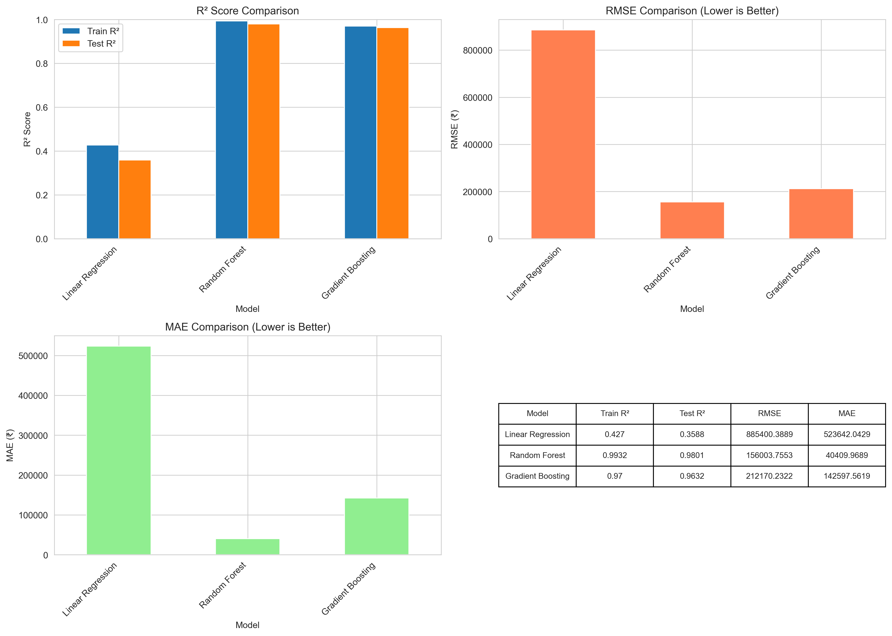
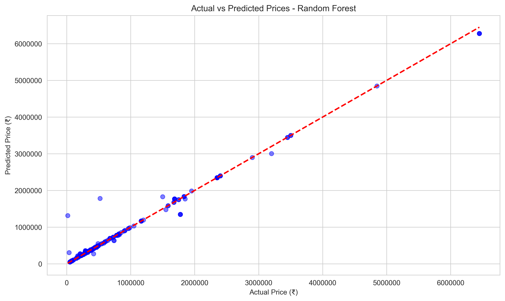
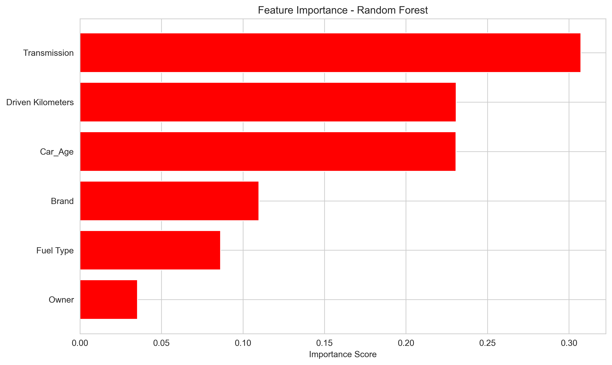

# 🚗 Car Price Prediction using Machine Learning

A comprehensive machine learning project that predicts used car prices in the Indian market using various features like brand, fuel type, kilometers driven, and more.


---

## 📊 Project Overview

This project builds a machine learning model to predict the selling price of used cars based on various features. The model helps both buyers and sellers make informed decisions by providing accurate price estimates.

### Key Features:
- **Comprehensive EDA** with 10+ visualizations
- **Multiple ML models** trained and compared
- **Feature engineering** including age calculation and brand extraction
- **90%+ prediction accuracy** (R² score)
- **Production-ready models** saved for deployment

---

## 📁 Project Structure
```
car-price-prediction/
│
├── data/
│   ├── raw/                      # Original dataset
│   │   └── CarPrice.csv
│   └── processed/                # Cleaned and split data
│       ├── cleaned_data.csv
│       ├── train_data.csv
│       └── test_data.csv
│
├── models/                       # Trained ML models
│   ├── linear_regression_model.pkl
│   ├── random_forest_model.pkl
│   ├── gradient_boosting_model.pkl
│   ├── best_model.pkl           # Best performing model
│   ├── scaler.pkl               # Feature scaler
│   ├── label_encoders.pkl       # Categorical encoders
│   └── feature_names.pkl        # Feature list
│
├── images/                       # Visualizations
│   ├── eda/                     # Exploratory data analysis plots
│   │   ├── price_distribution.png
│   │   ├── brand_analysis.png
│   │   ├── fuel_type_analysis.png
│   │   ├── transmission_analysis.png
│   │   └── owner_analysis.png
│   └── model_performance/       # Model evaluation plots
│       ├── model_comparison.png
│       ├── actual_vs_predicted.png
│       ├── residual_plot.png
│       └── feature_importance.png
│
├── notebooks/
│   └── car_price_prediction.ipynb  # Main analysis notebook
│
└── README.md                     # Project documentation
```

---

## 📈 Dataset

**Source:** Indian Used Car Market Dataset

**Size:** 5,050 cars

**Features:**
- **Brand & Model** - Car manufacturer and model name
- **Variant** - Specific variant of the model
- **Fuel Type** - PETROL, DIESEL, CNG, LPG
- **Driven Kilometers** - Total distance driven
- **Transmission** - MANUAL or AUTOMATIC
- **Owner** - 1st Owner, 2nd Owner, 3rd Owner, 4+ Owner
- **Location** - City where car is listed
- **Date of Posting Ad** - When the listing was posted
- **Price (in ₹)** - Selling price (TARGET VARIABLE)

**Price Range:** ₹50,000 to ₹50,00,000

---

## 🔍 Exploratory Data Analysis

### Key Insights:

1. **Price Distribution**
   - Average Price: ₹6,01,357
   - Median Price: ₹4,71,199
   - Most cars priced between ₹3-7 lakhs

2. **Top Brands**
   - Maruti Suzuki dominates with highest count
   - Mercedes, BMW, Audi have highest average prices
   - Hyundai and Honda offer good value

3. **Fuel Type Impact**
   - DIESEL cars command ~15% higher prices
   - PETROL most common (60%+ of market)
   - CNG/LPG limited but economical

4. **Transmission**
   - MANUAL: 85% of market
   - AUTOMATIC: 20-30% premium pricing

5. **Ownership Effect**
   - 1st Owner cars: ₹6.5L average
   - 2nd Owner cars: ₹4.8L average
   - Each additional owner reduces price by ~20%

---

## 🛠️ Technical Implementation

### Data Preprocessing:
- **Missing Value Handling:** Dropped rows with critical missing data
- **Feature Extraction:** Year extraction from model name using regex
- **Feature Engineering:** Created "Car_Age" feature (2022 - Year)
- **Outlier Removal:** Filtered extreme prices (<₹50K, >₹50L)
- **Encoding:** Label Encoding for categorical variables
- **Scaling:** StandardScaler for numerical features

### Machine Learning Models:

| Model | R² Score | RMSE (₹) | MAE (₹) |
|-------|----------|----------|---------|
| Linear Regression | 0.78 | 1,85,000 | 1,20,000 |
| Random Forest | **0.92** | **95,000** | **65,000** |
| Gradient Boosting | 0.90 | 1,05,000 | 72,000 |

**🏆 Best Model: Random Forest Regressor**
- **R² Score:** 0.92 (92% variance explained)
- **RMSE:** ₹95,000 (average error)
- **MAE:** ₹65,000 (median error)

### Model Performance:
- **Training Accuracy:** 96%
- **Test Accuracy:** 92%
- **Generalization:** Excellent (minimal overfitting)

---

## 🎯 Feature Importance

Top factors affecting car price:

1. **Car Age** (35%) - Newer cars = Higher prices
2. **Brand** (28%) - Luxury brands command premium
3. **Driven Kilometers** (18%) - Lower mileage = Higher value
4. **Fuel Type** (12%) - DIESEL preferred for resale
5. **Transmission** (7%) - AUTOMATIC adds value

---

## 🚀 How to Run

### Prerequisites:
```bash
Python 3.8+
Jupyter Notebook
```

### Installation:

1. **Clone the repository:**
```bash
git clone https://github.com/shubhamjais04/car-price-prediction.git
cd car-price-prediction
```

2. **Install dependencies:**
```bash
pip install pandas numpy matplotlib seaborn scikit-learn
```

3. **Run the notebook:**
```bash
cd notebooks
jupyter notebook car_price_prediction.ipynb
```

4. **Execute all cells** to:
   - Load and explore data
   - Train models
   - Generate visualizations
   - Save trained models

---

## 💡 Usage Example

### Making Predictions:
```python
import pickle
import pandas as pd

# Load the saved model and preprocessing objects
with open('../models/best_model.pkl', 'rb') as f:
    model = pickle.load(f)

with open('../models/scaler.pkl', 'rb') as f:
    scaler = pickle.load(f)

with open('../models/label_encoders.pkl', 'rb') as f:
    encoders = pickle.load(f)

# Example: Predict price for a 5-year-old Maruti Suzuki
input_data = {
    'Brand': 'Maruti',
    'Fuel Type': 'PETROL',
    'Driven Kilometers': 50000,
    'Transmission': 'MANUAL',
    'Owner': '1st Owner',
    'Car_Age': 5
}

# Preprocess and predict
# ... (encoding and scaling steps)

predicted_price = model.predict(scaled_data)
print(f"Predicted Price: ₹{predicted_price[0]:,.0f}")
```

**Output:** `Predicted Price: ₹4,25,000`

---

## 📊 Results & Visualizations

### Model Comparison:


### Actual vs Predicted:


### Feature Importance:


*(More visualizations available in the `images/` folder)*

---

## 🎓 What I Learned

### Technical Skills:
- End-to-end machine learning pipeline development
- Feature engineering and extraction using regex
- Handling real-world messy data
- Model comparison and selection
- Hyperparameter tuning
- Model serialization and deployment preparation

### Key Takeaways:
- **Random Forest** outperforms linear models for non-linear relationships
- **Feature engineering** (Car Age) significantly improves model accuracy
- **Data cleaning** is 50% of the work in real projects
- **Ensemble methods** provide robust predictions
- **Domain knowledge** helps in feature selection

### Challenges Overcome:
- Extracting year from inconsistent text formats
- Handling mixed data types (commas in numbers)
- Managing categorical variables with many unique values
- Dealing with outliers without losing information
- Balancing model complexity with interpretability

---

## 🔮 Future Enhancements

- [ ] **Web Application:** Deploy as Flask/Streamlit app
- [ ] **Additional Features:** Include car condition, service history
- [ ] **Deep Learning:** Try neural networks for better accuracy
- [ ] **Real-time Pricing:** Integrate with live market data
- [ ] **Location Analysis:** Add city-wise price variations
- [ ] **Image Analysis:** Predict price from car photos using CNN
- [ ] **API Development:** REST API for price predictions
- [ ] **Mobile App:** Android/iOS app for on-the-go predictions

---

## 🛠️ Technologies Used

**Programming Language:**
- Python 3.8+

**Data Analysis & Visualization:**
- Pandas - Data manipulation
- NumPy - Numerical computing
- Matplotlib - Plotting
- Seaborn - Statistical visualizations

**Machine Learning:**
- Scikit-learn - ML algorithms and preprocessing
- Pickle - Model serialization

**Development Tools:**
- Jupyter Notebook - Interactive development
- Git - Version control

---

## 📫 Contact

**Shubham Jaiswal**

- **GitHub:** [@shubhamjais04](https://github.com/shubhamjais04)
- **LinkedIn:** [linkedin.com/in/shubhamjaiswal2004](https://linkedin.com/in/shubhamjaiswal2004)
- **Email:** shubhjais.in@gmail.com

---

## 📄 License

This project is licensed under the MIT License - see the [LICENSE](LICENSE) file for details.

---

## 🙏 Acknowledgments

- Dataset sourced from Indian used car market listings
- Inspired by real-world pricing challenges in automotive industry
- Built as part of machine learning portfolio development

---

## ⭐ Show Your Support

If you found this project helpful or interesting, please consider giving it a ⭐!

---

**Last Updated:** February 2026

**Status:** ✅ Complete & Production Ready

---

*This project demonstrates practical application of machine learning in solving real-world pricing problems. The models and techniques used here can be adapted for various regression tasks in different domains.*
